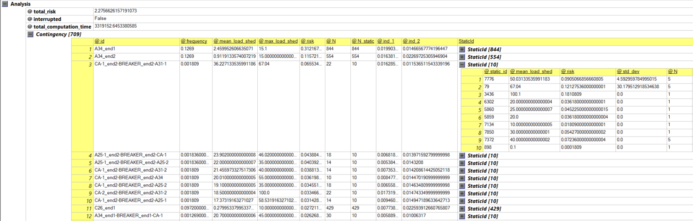

# PDSA-RTS-GMLC

This repo contains a collection of scripts to prepare a probabilistic dynamic security assessment (PDSA) of the Reliability Test System - Grid Modernization Lab Consortium version (RTS-GMLC).

It consists in:

1. A market model/unit commitment model based on [Prescient](https://github.com/grid-parity-exchange/Prescient). Prescient iterates between day-ahead and hourly dispatch. A (DC) nodal market (considering N-1 limits) is used here.
2. A preventive security constrained AC optimal power flow (PSCACOPF) to refine individual hourly dispatches
3. Scripts to add dynamic data to the RTS in [dynawo](https://dynawo.github.io/) format. These data have been checked to lead to an N-1 secure system (considering all possible line faults occurring at either end of the line and being cleared in 100ms by opening the line) for the cases January at hours 0 (min load), 13 (peak PV) and 17 (peak load), and July at hours 0 (min load) and 15 (peak load).
4. Scripts to perform the PDSA. Results are written to AnalysisOutput.xml. Results can be visualised using software that shows XML files in grid view, such as Ximple ([http://www.ximple.cz/](http://www.ximple.cz/), Windows only) as shown below.



# Usage

## Data preparation

The following scripts should be rerun if the input data in /RTS-Data is modified

```
cd RTS-Data
python source_to_iidm.py
cd timeseries_data_files/Load
python extrapolate.py
cd ../WIND
python extrapolate.py
```

## Prescient

```
cd 1-Prescient
python populate_prescient_inputs.py
python simulate_with_network_deterministic.py january
python prescient_outputs_to_csv.py january
```

## OPF

```
cd ../2-SCOPF
./run.sh
```
Note that a SLURM-based runner (run_cluster.sh) is also available for use in high-performing computing

## Dynamic data

```
cd ../3-DynData
python add_dyn_data.py
```

## PDSA

```
cd ../4-PDSA
mpiexec -n 2 main.py
```

to run locally. However, HPC is almost mandatory for PDSA (except if a limited number of contingencies/operating conditions is considered), so use the following command instead

```
sbatch PDSA.sh
```

Note: in the current implementation, all the results which are output in AnalysisOutput.xml are always loaded in RAM by the master process (in master.job_queue.simulation_results and master.job_queue.simulations_launched). To scale to larger grids, it would be needed for the master to only remember the information needed to schedule new jobs (i.e. load shedding/cost + protection sensitivity for each job). All the remaining information (output in AnalysisOutput.xml) should be stored in a database/on disk instead. Optimisation of some computations in Master.JobQueue.get_next_jobs() might also be useful. (For the RTS system, the master needs up to 4Go of RAM in the current implementation, while the slaves need only 1.)

# Requirements

## Prescient

Prescient
```
python -m pip install gridx-prescient
```

Optional: a pyomo-compatible MILP solver, e.g. Gurobi (note that a licence is required (free for academics))
```
python -m pip install gurobipy
```

## OPF

Pypowsybl
```
python -m pip install pypowsybl
```

[GAMS](https://www.gams.com/download/) and GAMS Python bindings. Note that depending on the GAMS version, different installation procedures are suggested for the python bindings, e.g. [link](https://www.gams.com/36/docs/API_PY_TUTORIAL.html) or [link](https://www.gams.com/43/docs/API_PY_GETTING_STARTED.html).

Tested with Python 3.9 and GAMS 36. Note that older versions of GAMS might not support recent versions of Python and that Pypowsybl requires Python >= 3.7

## DynData

```
python -m pip install pypowsybl lxml
```

## PDSA

```
python -m pip install pypowsybl lxml logger mpi4py natsort
```

Install [dynawo](https://dynawo.github.io/) and set DYNAWO_PATH in 4-PDSA/common.py accordingly. Currently, the dynamic models used are only available on my fork of Dynawo on the branch [30_RTQ2024](https://github.com/FredericSabot/dynawo/tree/30_RTS2024). You can compile it from source, or I can make release on demand.
